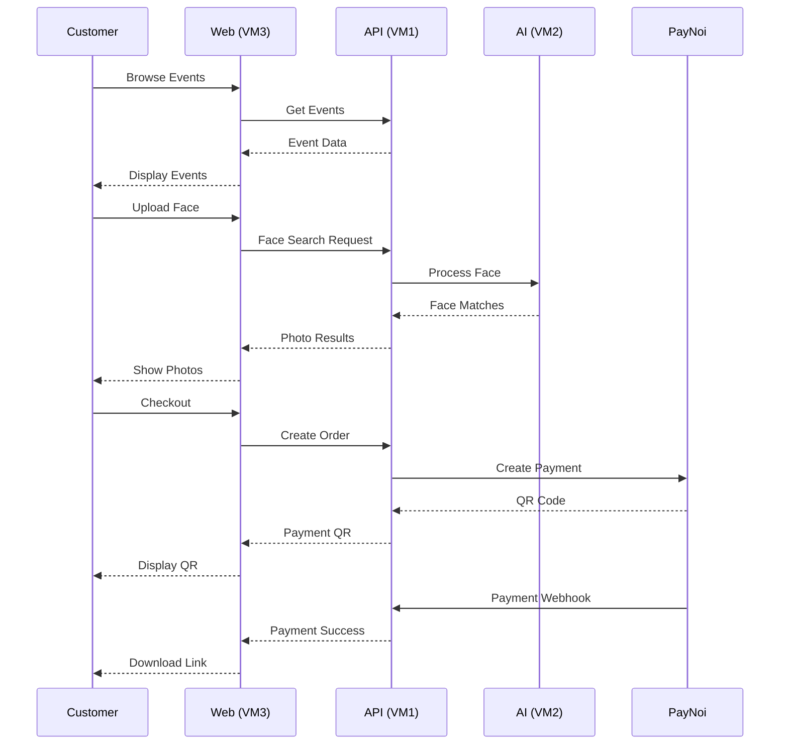
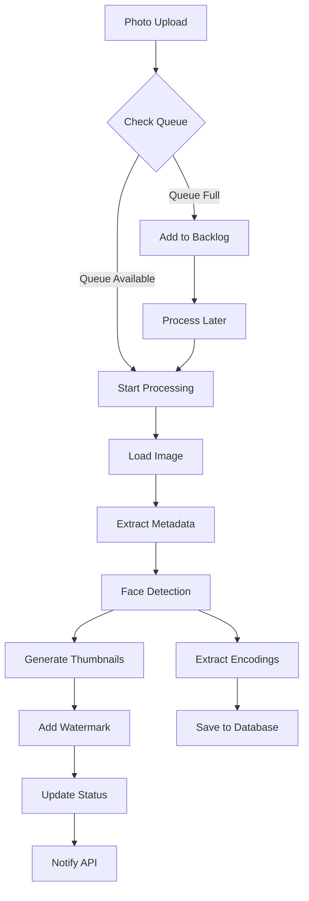

# ThePixStock - Event Photo Sales Platform
## Complete System Architecture & Requirements

## 📋 Executive Summary

ThePixStock เป็นแพลตฟอร์มขายภาพถ่ายจากงานอีเว้นต์ที่มีระบบ AI Face Recognition ให้ลูกค้าค้นหาภาพของตัวเองได้ง่าย พร้อมระบบจัดการสำหรับ Admin และช่างภาพ รองรับการทำงานแบบ Microservices บน 4 VM

### 🎯 Core Features
- **AI Face Recognition** - ค้นหารูปด้วยใบหน้า
- **Multi-Package Pricing** - ราคาแบบเดี่ยว/แพ็ค/ไม่จำกัด
- **Photographer Management** - ระบบจัดการช่างภาพ
- **Revenue Sharing** - แบ่งรายได้อัตโนมัติ
- **PayNoi Integration** - ชำระเงินผ่าน QR Code

### 📊 System Overview
- **Architecture**: Microservices on 4 VMs
- **Backend**: .NET 8 (C#)
- **AI Engine**: Python + Face Recognition
- **Database**: PostgreSQL + Redis
- **Storage**: MinIO (S3-compatible)
- **Payment**: PayNoi Gateway

---

## 🏗️ System Architecture

### Infrastructure Layout
```
┌──────────────────────────────────────────────────────┐
│                   Load Balancer                       │
│                  (SSL Termination)                    │
└──────────────┬───────────────────────────────────────┘
               │
    ┌──────────┴──────────┬──────────────┬────────────┐
    │                     │              │            │
┌───▼────┐         ┌──────▼──────┐ ┌────▼────┐ ┌────▼────┐
│  VM1   │         │     VM2     │ │   VM3   │ │   VM4   │
│  API   │◄────────┤     AI      │ │   Web   │ │Monitor  │
│  Server│         │  Processing │ │Frontend │ │         │
├────────┤         ├─────────────┤ ├─────────┤ ├─────────┤
│.NET 8  │         │Python       │ │Vue.js   │ │Grafana  │
│PostgreSQL        │Face Recog   │ │Nginx    │ │Prometheus
│Redis   │         │OpenCV       │ │Admin    │ │Loki     │
│MinIO   │         │Celery       │ │Customer │ │Alert    │
└────────┘         └─────────────┘ └─────────┘ └─────────┘
```

### Data Flow


---

## 🖥️ VM1: API Server Specification

### System Requirements
| Component | Specification |
|-----------|--------------|
| OS | Debian 12 |
| CPU | 8 vCPU |
| RAM | 16 GB |
| Storage | 500 GB SSD |
| Network | Public IP with SSL |
| Bandwidth | 1 Gbps |

### Software Stack
```yaml
Runtime:
  - .NET 8 SDK & Runtime
  - ASP.NET Core 8

Database:
  - PostgreSQL 15
  - Redis 7.2
  
Storage:
  - MinIO (Latest)
  
Web Server:
  - Kestrel (Built-in)
  - Nginx (Reverse Proxy)
  
Security:
  - SSL Certificate (Let's Encrypt)
  - Fail2ban
  - UFW Firewall
```

### API Modules & Endpoints

#### 1. Authentication Module
| Method | Endpoint | Description | Access |
|--------|----------|-------------|--------|
| POST | /api/auth/register | User registration | Public |
| POST | /api/auth/login | User login | Public |
| POST | /api/auth/refresh | Refresh token | Auth |
| POST | /api/auth/logout | User logout | Auth |
| POST | /api/auth/forgot-password | Request password reset | Public |
| POST | /api/auth/reset-password | Reset password | Public |
| GET | /api/auth/verify-email | Verify email | Public |
| POST | /api/auth/change-password | Change password | Auth |

#### 2. Event Management Module
| Method | Endpoint | Description | Access |
|--------|----------|-------------|--------|
| GET | /api/events | List all events | Public |
| GET | /api/events/{id} | Get event details | Public |
| POST | /api/events | Create event | Admin |
| PUT | /api/events/{id} | Update event | Admin |
| DELETE | /api/events/{id} | Delete event | Admin |
| PUT | /api/events/{id}/status | Update event status | Admin |
| GET | /api/events/{id}/statistics | Get event stats | Admin |
| POST | /api/events/{id}/announce | Send announcement | Admin |

#### 3. Photo Management Module
| Method | Endpoint | Description | Access |
|--------|----------|-------------|--------|
| POST | /api/photos/upload | Upload single photo | Photographer |
| POST | /api/photos/batch-upload | Upload multiple photos | Photographer |
| GET | /api/photos/{id} | Get photo (watermarked) | Public |
| GET | /api/photos/{id}/original | Get original photo | Purchased |
| PUT | /api/photos/{id}/approve | Approve photo | Admin |
| PUT | /api/photos/{id}/reject | Reject photo | Admin |
| DELETE | /api/photos/{id} | Delete photo | Admin |
| GET | /api/photos/{id}/metadata | Get photo metadata | Auth |

#### 4. Face Recognition Module
| Method | Endpoint | Description | Access |
|--------|----------|-------------|--------|
| POST | /api/face/search | Search by face | Public |
| GET | /api/face/search/{id}/status | Get search status | Public |
| GET | /api/face/search/{id}/results | Get search results | Public |
| POST | /api/face/feedback | Submit feedback | Auth |
| GET | /api/photos/{id}/faces | Get faces in photo | Admin |
| POST | /api/face/group | Group similar faces | Admin |

#### 5. Package & Pricing Module
| Method | Endpoint | Description | Access |
|--------|----------|-------------|--------|
| GET | /api/packages | List all packages | Public |
| POST | /api/packages | Create package | Admin |
| PUT | /api/packages/{id} | Update package | Admin |
| DELETE | /api/packages/{id} | Delete package | Admin |
| GET | /api/events/{id}/packages | Get event packages | Public |
| POST | /api/events/{id}/packages | Set event packages | Admin |

#### 6. Shopping Cart Module
| Method | Endpoint | Description | Access |
|--------|----------|-------------|--------|
| GET | /api/cart | Get cart | Session |
| POST | /api/cart/items | Add to cart | Session |
| PUT | /api/cart/items/{id} | Update cart item | Session |
| DELETE | /api/cart/items/{id} | Remove from cart | Session |
| POST | /api/cart/clear | Clear cart | Session |
| PUT | /api/cart/package | Select package | Session |
| GET | /api/cart/summary | Get cart summary | Session |

#### 7. Payment Module (PayNoi)
| Method | Endpoint | Description | Access |
|--------|----------|-------------|--------|
| POST | /api/payment/create | Create payment | Auth |
| GET | /api/payment/{id}/status | Check payment status | Auth |
| POST | /api/payment/webhook | PayNoi webhook | PayNoi |
| GET | /api/payment/history | Payment history | Auth |
| POST | /api/payment/refund | Request refund | Auth |

#### 8. Order Module
| Method | Endpoint | Description | Access |
|--------|----------|-------------|--------|
| POST | /api/orders | Create order | Auth |
| GET | /api/orders | List orders | Auth |
| GET | /api/orders/{id} | Get order details | Auth |
| GET | /api/orders/{id}/invoice | Get invoice | Auth |
| GET | /api/orders/{id}/download | Get download link | Auth |
| POST | /api/orders/{id}/redownload | Request redownload | Auth |

#### 9. Revenue Management Module
| Method | Endpoint | Description | Access |
|--------|----------|-------------|--------|
| GET | /api/revenue/summary | Revenue summary | Admin |
| GET | /api/revenue/events/{id} | Event revenue | Admin |
| GET | /api/revenue/photographers | Photographer earnings | Admin |
| POST | /api/revenue/split-rules | Set split rules | Admin |
| GET | /api/revenue/payouts | List payouts | Admin |
| POST | /api/revenue/payouts | Create payout | Admin |

#### 10. Admin Dashboard Module
| Method | Endpoint | Description | Access |
|--------|----------|-------------|--------|
| GET | /api/admin/dashboard | Dashboard data | Admin |
| GET | /api/admin/statistics | System statistics | Admin |
| GET | /api/admin/users | List users | Admin |
| PUT | /api/admin/users/{id}/role | Update user role | Admin |
| GET | /api/admin/logs | System logs | Admin |
| GET | /api/admin/settings | System settings | Admin |
| PUT | /api/admin/settings | Update settings | Admin |

### Database Schema Summary

#### Core Tables (49 Total)
```sql
-- Phase 0: Foundation (8 tables)
CREATE TABLE users (
    id SERIAL PRIMARY KEY,
    email VARCHAR(255) UNIQUE NOT NULL,
    password_hash VARCHAR(255) NOT NULL,
    role VARCHAR(20) NOT NULL,
    first_name VARCHAR(100),
    last_name VARCHAR(100),
    phone VARCHAR(20),
    is_active BOOLEAN DEFAULT TRUE,
    email_verified BOOLEAN DEFAULT FALSE,
    created_at TIMESTAMP DEFAULT CURRENT_TIMESTAMP,
    updated_at TIMESTAMP DEFAULT CURRENT_TIMESTAMP
);

CREATE TABLE events (
    id SERIAL PRIMARY KEY,
    name VARCHAR(255) NOT NULL,
    description TEXT,
    event_date DATE,
    location VARCHAR(255),
    venue VARCHAR(255),
    status VARCHAR(20) DEFAULT 'planning',
    sales_enabled BOOLEAN DEFAULT FALSE,
    sales_start_date TIMESTAMP,
    sales_end_date TIMESTAMP,
    created_by INT REFERENCES users(id),
    created_at TIMESTAMP DEFAULT CURRENT_TIMESTAMP
);

CREATE TABLE photographers (
    id SERIAL PRIMARY KEY,
    user_id INT REFERENCES users(id),
    portfolio_url VARCHAR(500),
    commission_rate DECIMAL(5,2) DEFAULT 0.00,
    bank_account_name VARCHAR(255),
    bank_account_number VARCHAR(50),
    bank_name VARCHAR(100),
    total_revenue_generated DECIMAL(12,2) DEFAULT 0.00
);

-- Additional tables listed in full schema...
```

### Redis Cache Strategy
```yaml
Cache Keys:
  user:session:{token}: User session data (TTL: 24h)
  cart:{session_id}: Shopping cart (TTL: 7d)
  event:popular: Popular events (TTL: 1h)
  photo:views:{id}: Photo view count (TTL: permanent)
  search:result:{hash}: Face search cache (TTL: 1h)
  
Rate Limiting:
  api:rate:{ip}: API rate limit (100/min)
  upload:rate:{user}: Upload rate limit (50/hour)
  search:rate:{ip}: Face search limit (10/min)
```

### MinIO Storage Structure
```
/thepixstock/
├── events/
│   ├── {event_id}/
│   │   ├── originals/          # Original photos
│   │   │   └── {photo_id}.jpg
│   │   ├── thumbnails/         # Generated thumbnails
│   │   │   ├── small/          # 150x150
│   │   │   ├── medium/         # 300x300
│   │   │   └── large/          # 800x600
│   │   ├── watermarked/        # Preview with watermark
│   │   │   └── {photo_id}_wm.jpg
│   │   └── downloads/          # Prepared for download
│   │       └── {order_id}.zip
├── faces/
│   ├── searches/               # User uploaded faces
│   │   └── {search_id}.jpg
│   └── encodings/              # Face encodings
│       └── {event_id}/
│           └── {photo_id}.json
├── temp/                       # Temporary files
│   └── uploads/
└── backups/                    # Database backups
    └── {date}/
```

---

## 🤖 VM2: AI Processing Specification

### System Requirements
| Component | Specification |
|-----------|--------------|
| OS | Debian 12 |
| CPU | 8 vCPU (AVX support) |
| RAM | 32 GB |
| GPU | Optional (NVIDIA) |
| Storage | 200 GB SSD |

### Software Stack
```yaml
Runtime:
  - Python 3.11
  - Virtual Environment
  
AI Libraries:
  - face_recognition 1.3.0
  - dlib 19.24
  - OpenCV 4.8
  - Pillow 10.0
  - numpy 1.24
  - scikit-learn 1.3
  
Queue System:
  - Celery 5.3
  - Redis (broker)
  - Flower (monitoring)
  
Image Processing:
  - ImageMagick
  - libvips
```

### AI Services Architecture

#### 1. Face Detection Service
```python
# Service Capabilities
class FaceDetectionService:
    """
    Functions:
    - detect_faces(photo_path) -> List[Face]
    - extract_face_encoding(face_image) -> np.array
    - calculate_face_quality(face_image) -> float
    - estimate_attributes(face_image) -> dict
    """
    
    Processing Pipeline:
    1. Load image from MinIO
    2. Detect all faces using HOG/CNN
    3. Extract 128-dimensional encodings
    4. Calculate quality score (blur, lighting)
    5. Estimate age, gender (optional)
    6. Save encodings to database
    7. Update photo processing status
    
    Performance Metrics:
    - Detection accuracy: > 95%
    - Processing speed: 2-5 seconds/photo
    - Batch processing: 100 photos/batch
```

#### 2. Face Search Service
```python
# Search Implementation
class FaceSearchService:
    """
    Functions:
    - search_by_face(upload_image, event_id) -> List[Match]
    - compare_faces(encoding1, encoding2) -> float
    - group_similar_faces(event_id) -> List[Group]
    - optimize_search_index(event_id) -> None
    """
    
    Search Algorithm:
    1. Extract encoding from uploaded image
    2. Load event face encodings from cache
    3. Calculate euclidean distances
    4. Apply threshold (0.6 default)
    5. Rank by similarity score
    6. Return top N matches
    
    Optimization:
    - Use KD-tree for large datasets
    - Cache encodings in Redis
    - Parallel processing for batches
```

#### 3. Image Processing Service
```python
# Image Operations
class ImageProcessingService:
    """
    Functions:
    - create_thumbnails(photo_path) -> dict
    - add_watermark(photo_path, text) -> str
    - extract_metadata(photo_path) -> dict
    - optimize_image(photo_path) -> str
    - auto_enhance(photo_path) -> str
    """
    
    Thumbnail Specifications:
    - Small: 150x150 (JPEG 80%)
    - Medium: 300x300 (JPEG 85%)
    - Large: 800x600 (JPEG 90%)
    - Preview: 1920x1080 (JPEG 85% + watermark)
    
    Watermark Settings:
    - Position: Bottom-right
    - Opacity: 30%
    - Font: Arial Bold
    - Size: Adaptive to image
```

#### 4. Queue Management
```python
# Celery Task Configuration
CELERY_TASK_ROUTES = {
    'face.detect': {'queue': 'high_priority'},
    'face.search': {'queue': 'high_priority'},
    'image.thumbnail': {'queue': 'medium_priority'},
    'image.watermark': {'queue': 'medium_priority'},
    'batch.process': {'queue': 'low_priority'},
}

CELERY_TASK_TIME_LIMIT = 300  # 5 minutes
CELERY_TASK_SOFT_TIME_LIMIT = 240  # 4 minutes
CELERY_TASK_MAX_RETRIES = 3
CELERY_TASK_RETRY_DELAY = 60  # 1 minute
```

### Processing Workflow



### Performance Optimization

#### GPU Acceleration (Optional)
```yaml
CUDA Configuration:
  - CUDA Toolkit 11.8
  - cuDNN 8.6
  - TensorRT 8.5
  
Performance Gains:
  - Face detection: 10x faster
  - Batch processing: 20x faster
  - Real-time processing possible
```

#### Caching Strategy
```yaml
Redis Cache:
  face:encoding:{photo_id}: Face encodings (permanent)
  face:search:{event_id}: Event encodings (TTL: 24h)
  image:metadata:{photo_id}: EXIF data (permanent)
  processing:status:{job_id}: Job status (TTL: 1h)
```

---

## 🌐 VM3: Web Frontend Specification

### System Requirements
| Component | Specification |
|-----------|--------------|
| OS | Debian 12 |
| CPU | 4 vCPU |
| RAM | 8 GB |
| Storage | 100 GB SSD |
| Network | Public IP with SSL |

### Software Stack
```yaml
Runtime:
  - Node.js 20 LTS
  - npm/yarn
  
Framework:
  - Vue.js 3.3
  - Vite 5.0
  - Vue Router 4
  - Pinia (State Management)
  
UI Libraries:
  - Tailwind CSS 3.3
  - Headless UI
  - Heroicons
  
Build Tools:
  - TypeScript 5.2
  - ESLint
  - Prettier
  
Web Server:
  - Nginx 1.24
  - PM2 (Process Manager)
  - Certbot (SSL)
```

### Customer Web Application

#### Page Structure
```
/
├── Home (Event Listing)
├── Events
│   ├── {id} (Event Detail)
│   ├── {id}/photos (Gallery)
│   └── {id}/find-me (Face Search)
├── Auth
│   ├── login
│   ├── register
│   ├── forgot-password
│   └── reset-password
├── Account
│   ├── dashboard
│   ├── orders
│   ├── downloads
│   └── profile
├── Cart
├── Checkout
│   ├── payment
│   └── success
└── Legal
    ├── privacy
    └── terms
```

#### Key Features Implementation

##### 1. Face Search UI
```vue
<!-- FaceSearch.vue -->
<template>
  <div class="face-search">
    <!-- Step 1: Upload/Camera -->
    <div v-if="step === 1">
      <input type="file" @change="handleFileUpload" accept="image/*">
      <button @click="openCamera">Take Photo</button>
    </div>
    
    <!-- Step 2: Crop Face -->
    <div v-if="step === 2">
      
      <button @click="cropFace">Crop & Search</button>
    </div>
    
    <!-- Step 3: Results -->
    <div v-if="step === 3">
      <div class="results-grid">
        <PhotoCard 
          v-for="result in searchResults"
          :key="result.id"
          :photo="result"
          :confidence="result.confidence"
        />
      </div>
    </div>
  </div>
</template>
```

##### 2. Shopping Cart
```vue
<!-- Cart.vue -->
<template>
  <div class="shopping-cart">
    <!-- Package Selection -->
    <div class="package-selector">
      <PackageCard 
        v-for="pkg in packages"
        :key="pkg.id"
        :package="pkg"
        :selected="selectedPackage === pkg.id"
        @select="selectPackage"
      />
    </div>
    
    <!-- Selected Photos -->
    <div class="cart-items">
      <CartItem 
        v-for="item in cartItems"
        :key="item.id"
        :item="item"
        @remove="removeItem"
      />
    </div>
    
    <!-- Summary -->
    <div class="cart-summary">
      <p>Total: {{ formatPrice(total) }} THB</p>
      <button @click="checkout">Proceed to Payment</button>
    </div>
  </div>
</template>
```

##### 3. Payment Integration
```javascript
// PayNoi Payment Handler
class PaymentService {
  async createPayment(orderId, amount) {
    const response = await api.post('/payment/create', {
      order_id: orderId,
      amount: amount
    });
    
    return {
      transactionId: response.data.trans_id,
      qrCode: response.data.qr_image_base64,
      expireAt: response.data.expire_at
    };
  }
  
  async checkStatus(transactionId) {
    const response = await api.get(`/payment/${transactionId}/status`);
    return response.data.payment_status;
  }
  
  startPolling(transactionId, callback) {
    const interval = setInterval(async () => {
      const status = await this.checkStatus(transactionId);
      if (status === 'completed') {
        clearInterval(interval);
        callback(true);
      }
    }, 3000); // Check every 3 seconds
  }
}
```

### Admin Panel Application

#### Module Structure
```
/admin/
├── Dashboard
│   ├── Overview
│   ├── Revenue
│   └── Activities
├── Events
│   ├── List
│   ├── Create
│   ├── Edit
│   └── Analytics
├── Photos
│   ├── Upload
│   ├── Approval
│   └── Management
├── Users
│   ├── Customers
│   ├── Photographers
│   └── Admins
├── Orders
│   ├── List
│   ├── Details
│   └── Refunds
├── Revenue
│   ├── Reports
│   ├── Commissions
│   └── Payouts
└── Settings
    ├── System
    ├── Packages
    └── Email Templates
```

#### Admin Features

##### 1. Bulk Photo Upload
```vue
<!-- PhotoUpload.vue -->
<template>
  <div class="photo-upload">
    <Dropzone 
      @drop="handleDrop"
      :multiple="true"
      :maxFiles="50"
      accept="image/*"
    >
      <p>Drag & drop photos or click to browse</p>
    </Dropzone>
    
    <div class="upload-queue">
      <UploadItem 
        v-for="file in uploadQueue"
        :key="file.id"
        :file="file"
        :progress="file.progress"
        :status="file.status"
      />
    </div>
    
    <button @click="startUpload">Start Upload</button>
  </div>
</template>
```

##### 2. Photo Approval System
```vue
<!-- PhotoApproval.vue -->
<template>
  <div class="photo-approval">
    <div class="filters">
      <select v-model="filterStatus">
        <option value="pending">Pending</option>
        <option value="approved">Approved</option>
        <option value="rejected">Rejected</option>
      </select>
    </div>
    
    <div class="photo-grid">
      <div v-for="photo in photos" :key="photo.id">
        
        <div class="actions">
          <button @click="approve(photo.id)">✓</button>
          <button @click="reject(photo.id)">✗</button>
          <button @click="viewDetails(photo.id)">👁</button>
        </div>
      </div>
    </div>
    
    <div class="bulk-actions">
      <button @click="approveAll">Approve All</button>
      <button @click="rejectSelected">Reject Selected</button>
    </div>
  </div>
</template>
```

##### 3. Revenue Dashboard
```vue
<!-- RevenueDashboard.vue -->
<template>
  <div class="revenue-dashboard">
    <!-- Summary Cards -->
    <div class="stats-grid">
      <StatCard title="Today" :value="todayRevenue" />
      <StatCard title="This Month" :value="monthRevenue" />
      <StatCard title="This Year" :value="yearRevenue" />
    </div>
    
    <!-- Revenue Chart -->
    <LineChart 
      :data="revenueChartData"
      :options="chartOptions"
    />
    
    <!-- Top Events -->
    <DataTable 
      :columns="eventColumns"
      :data="topEvents"
      title="Top Performing Events"
    />
    
    <!-- Commission Breakdown -->
    <PieChart 
      :data="commissionData"
      title="Revenue Split"
    />
  </div>
</template>
```

### UI/UX Guidelines

#### Design System
```css
/* Color Palette */
:root {
  --primary: #D4AF37;      /* Gold */
  --primary-dark: #B8941F;  /* Dark Gold */
  --secondary: #1A1A1A;     /* Black */
  --success: #10B981;       /* Green */
  --warning: #F59E0B;       /* Amber */
  --error: #EF4444;         /* Red */
  --gray-50: #F9FAFB;
  --gray-100: #F3F4F6;
  --gray-900: #111827;
}

/* Typography */
--font-sans: 'Inter', system-ui, sans-serif;
--font-display: 'Playfair Display', serif;

/* Breakpoints */
--sm: 640px;   /* Mobile */
--md: 768px;   /* Tablet */
--lg: 1024px;  /* Desktop */
--xl: 1280px;  /* Large Desktop */
```

#### Component Library
- **Buttons**: Primary, Secondary, Ghost, Danger
- **Forms**: Input, Select, Checkbox, Radio, Switch
- **Feedback**: Alert, Toast, Modal, Drawer
- **Navigation**: Navbar, Sidebar, Tabs, Breadcrumb
- **Data**: Table, Card, List, Grid
- **Media**: Image Gallery, Video Player, Lightbox

---

## 📊 VM4: Monitoring Specification

### System Requirements
| Component | Specification |
|-----------|--------------|
| OS | Debian 12 |
| CPU | 2 vCPU |
| RAM | 4 GB |
| Storage | 100 GB SSD |

### Software Stack
```yaml
Metrics:
  - Prometheus 2.47
  - Node Exporter 1.6
  - Postgres Exporter
  - Redis Exporter
  
Visualization:
  - Grafana 10.1
  - Custom Dashboards
  
Logging:
  - Loki 2.9
  - Promtail 2.9
  
Alerting:
  - AlertManager 0.26
  - Integration with Line Notify
```

### Monitoring Dashboards

#### 1. System Overview Dashboard
```yaml
Panels:
  - CPU Usage (per VM)
  - Memory Usage (per VM)
  - Disk I/O
  - Network Traffic
  - System Load
  - Uptime Status
  
Alerts:
  - CPU > 80% for 5 minutes
  - Memory > 90%
  - Disk > 85%
  - Service Down
```

#### 2. Application Dashboard
```yaml
Panels:
  - API Request Rate
  - Response Time (p50, p95, p99)
  - Error Rate
  - Active Users
  - Database Connections
  - Redis Memory Usage
  
Alerts:
  - Error rate > 1%
  - Response time p95 > 2s
  - Database connections > 90%
```

#### 3. Business Metrics Dashboard
```yaml
Panels:
  - Daily Revenue
  - Orders Created
  - Photos Uploaded
  - Face Searches
  - Conversion Rate
  - Active Events
  
Reports:
  - Daily summary email
  - Weekly performance report
  - Monthly revenue report
```

#### 4. AI Processing Dashboard
```yaml
Panels:
  - Processing Queue Length
  - Jobs Completed/Failed
  - Average Processing Time
  - Face Detection Accuracy
  - GPU/CPU Usage
  
Alerts:
  - Queue length > 1000
  - Failure rate > 5%
  - Processing time > 10s
```

### Alert Configuration

#### Critical Alerts (Immediate)
```yaml
- Service Down
- Database Connection Failed
- Payment Gateway Error
- Storage Full > 95%
- Security Breach Detected
```

#### Warning Alerts (15 min)
```yaml
- High CPU Usage > 80%
- Memory Usage > 85%
- Slow API Response > 2s
- Queue Backlog > 500
- Failed Jobs > 10%
```

#### Info Alerts (1 hour)
```yaml
- SSL Certificate Expiring (30 days)
- Low Disk Space < 20%
- Unusual Traffic Pattern
- Failed Login Attempts > 10
```

### Log Management

#### Log Collection
```yaml
Sources:
  - API Server (VM1)
    - Application logs
    - Access logs
    - Error logs
  
  - AI Service (VM2)
    - Processing logs
    - Queue logs
    - Model logs
  
  - Web Server (VM3)
    - Nginx access logs
    - Application logs
    - Security logs
  
Retention:
  - Application logs: 30 days
  - Access logs: 90 days
  - Security logs: 1 year
  - Audit logs: 3 years
```

---

## 💰 PayNoi Integration Details

### API Configuration
```javascript
// PayNoi Configuration
const PAYNOI_CONFIG = {
  baseUrl: 'https://paynoi.com/ppay_api',
  apiKey: '2e5d01f3400e42cb263946237190d9107800bf316ec29d9cd41cdccc133c3af7',
  keyId: '100568',
  account: '1234567890',
  type: '1', // PromptPay
  timeout: 15 * 60 * 1000, // 15 minutes
  webhookSecret: 'your-webhook-secret'
};
```

### Payment Flow Implementation

#### 1. Create Payment
```csharp
public async Task<PaymentResponse> CreatePayment(decimal amount, string orderId)
{
    var request = new
    {
        method = "create",
        api_key = _config.ApiKey,
        amount = amount,
        ref1 = orderId,
        key_id = _config.KeyId,
        account = _config.Account,
        type = _config.Type
    };
    
    var response = await _httpClient.PostAsJsonAsync(_config.BaseUrl, request);
    var result = await response.Content.ReadFromJsonAsync<PayNoiResponse>();
    
    // Save transaction to database
    await _paymentRepository.CreateTransaction(new Payment
    {
        OrderId = orderId,
        TransactionId = result.TransId,
        Amount = amount,
        Status = PaymentStatus.Pending,
        ExpireAt = result.ExpireAt
    });
    
    return new PaymentResponse
    {
        TransactionId = result.TransId,
        QrCode = result.QrImageBase64,
        Amount = result.Amount,
        ExpireAt = result.ExpireAt
    };
}
```

#### 2. Check Payment Status
```csharp
public async Task<PaymentStatus> CheckPaymentStatus(string transactionId)
{
    var request = new
    {
        method = "check",
        api_key = _config.ApiKey,
        trans_id = transactionId
    };
    
    var response = await _httpClient.PostAsJsonAsync(_config.BaseUrl, request);
    var result = await response.Content.ReadFromJsonAsync<PayNoiStatusResponse>();
    
    return result.PaymentStatus switch
    {
        "completed" => PaymentStatus.Completed,
        "pending" => PaymentStatus.Pending,
        "failed" => PaymentStatus.Failed,
        _ => PaymentStatus.Unknown
    };
}
```

#### 3. Handle Webhook
```csharp
[HttpPost("api/payment/webhook")]
public async Task<IActionResult> PaymentWebhook([FromBody] PayNoiWebhook webhook)
{
    // Verify signature
    if (!VerifyWebhookSignature(webhook))
    {
        return Unauthorized();
    }
    
    // Update payment status
    var payment = await _paymentRepository.GetByTransactionId(webhook.Data.TransId);
    if (payment != null)
    {
        payment.Status = PaymentStatus.Completed;
        payment.CompletedAt = DateTime.UtcNow;
        await _paymentRepository.Update(payment);
        
        // Process order
        await _orderService.CompleteOrder(payment.OrderId);
        
        // Send notification
        await _notificationService.SendPaymentSuccess(payment.OrderId);
    }
    
    return Ok(new { status = 1 });
}

private bool VerifyWebhookSignature(PayNoiWebhook webhook)
{
    var data = JsonSerializer.Serialize(webhook.Data);
    var expectedSignature = ComputeHmacSha256(data, _config.ApiKey);
    return webhook.Signature == expectedSignature;
}
```

---

## 📋 Implementation Schedule

### Phase 1: Foundation (Week 1-2)
#### VM1 Tasks
- [ ] Setup PostgreSQL database with all 49 tables
- [ ] Configure Redis for caching and sessions
- [ ] Setup MinIO for file storage
- [ ] Implement JWT authentication
- [ ] Create basic CRUD APIs for events
- [ ] Setup Nginx reverse proxy

#### VM3 Tasks
- [ ] Setup Vue.js project structure
- [ ] Create basic layouts and routing
- [ ] Implement authentication pages
- [ ] Build event listing page
- [ ] Setup Tailwind CSS

### Phase 2: Core Features (Week 3-4)
#### VM1 Tasks
- [ ] Implement photo upload APIs
- [ ] Create package management system
- [ ] Build shopping cart functionality
- [ ] Integrate PayNoi payment gateway
- [ ] Develop order processing system

#### VM2 Tasks
- [ ] Setup Python environment
- [ ] Implement face detection
- [ ] Create thumbnail generation
- [ ] Setup Celery task queue
- [ ] Build watermark system

#### VM3 Tasks
- [ ] Create photo gallery UI
- [ ] Implement shopping cart
- [ ] Build payment flow with QR display
- [ ] Create customer dashboard
- [ ] Setup admin panel structure

### Phase 3: AI Integration (Week 5-6)
#### VM1 Tasks
- [ ] Create face search APIs
- [ ] Implement download system
- [ ] Build revenue management
- [ ] Add analytics endpoints

#### VM2 Tasks
- [ ] Implement face recognition search
- [ ] Optimize batch processing
- [ ] Setup face grouping
- [ ] Performance tuning

#### VM3 Tasks
- [ ] Build face search UI
- [ ] Create photo approval interface
- [ ] Implement bulk upload
- [ ] Add revenue dashboard

### Phase 4: Polish & Deployment (Week 7-8)
#### VM1 Tasks
- [ ] Performance optimization
- [ ] Security hardening
- [ ] API documentation
- [ ] Load testing

#### VM2 Tasks
- [ ] AI model optimization
- [ ] Error recovery system
- [ ] Batch processing improvements

#### VM3 Tasks
- [ ] UI/UX improvements
- [ ] Mobile optimization
- [ ] Cross-browser testing
- [ ] SEO optimization

#### VM4 Tasks
- [ ] Setup Prometheus & Grafana
- [ ] Configure monitoring dashboards
- [ ] Setup alerting rules
- [ ] Create backup procedures

---

## 🔒 Security Measures

### Application Security
```yaml
Authentication:
  - JWT with refresh tokens
  - Password complexity requirements
  - Account lockout after 5 failed attempts
  - Email verification required
  
Authorization:
  - Role-based access control (RBAC)
  - API key for service-to-service
  - Resource-level permissions
  
Data Protection:
  - Encrypt passwords with bcrypt
  - Encrypt sensitive data at rest
  - Use HTTPS everywhere
  - Secure cookie flags
```

### Infrastructure Security
```yaml
Network:
  - Firewall rules (UFW)
  - SSH key-only access
  - VPN for admin access
  - DDoS protection
  
Monitoring:
  - Intrusion detection (Fail2ban)
  - Log analysis
  - Vulnerability scanning
  - Security updates automation
```

### Compliance
```yaml
GDPR/PDPA:
  - Privacy policy
  - Data consent tracking
  - Right to deletion
  - Data export capability
  
Payment:
  - PCI DSS compliance (via PayNoi)
  - No credit card storage
  - Secure webhook validation
  - Transaction logging
```

---

## 📈 Performance Targets

### SLA Requirements
| Metric | Target | Measurement |
|--------|--------|-------------|
| Uptime | 99.9% | Monthly |
| API Response Time | < 200ms | p95 |
| Page Load Time | < 2s | p90 |
| Photo Processing | < 5 min | Average |
| Face Search | < 5s | p95 |
| Payment Success Rate | > 95% | Daily |

### Scalability Targets
| Resource | Capacity | Growth |
|----------|----------|--------|
| Concurrent Users | 10,000 | 20% MoM |
| Photos/Hour | 1,000 | 50% YoY |
| Storage | 10TB | 100GB/month |
| Orders/Day | 500 | 30% MoM |
| Events/Month | 50 | 10% MoM |

---

## 💵 Revenue Model & Pricing

### Package Pricing Structure
| Package Type | Photos | Price (THB) | Value |
|--------------|--------|-------------|-------|
| Single | 1 | 60 | - |
| Small Bundle | 5 | 250 | Save 50 THB |
| Unlimited | ∞ | 500 | Best Value |

### Revenue Split Model
```yaml
Default Split:
  Platform Fee: 30%
  Photographer: 50%
  Event Organizer: 20%
  
Premium Events:
  Platform Fee: 25%
  Photographer: 55%
  Event Organizer: 20%
  
Special Cases:
  - Platform-owned events: 100% platform
  - Charity events: Customizable
  - Corporate events: Negotiable
```

### Commission Calculation
```sql
-- Calculate photographer commission
CREATE OR REPLACE FUNCTION calculate_commission(
    order_amount DECIMAL,
    photographer_rate DECIMAL,
    event_type VARCHAR
) RETURNS TABLE (
    platform_fee DECIMAL,
    photographer_commission DECIMAL,
    organizer_share DECIMAL
) AS $$
BEGIN
    IF event_type = 'premium' THEN
        platform_fee := order_amount * 0.25;
        photographer_commission := order_amount * (photographer_rate / 100);
        organizer_share := order_amount * 0.20;
    ELSE
        platform_fee := order_amount * 0.30;
        photographer_commission := order_amount * (photographer_rate / 100);
        organizer_share := order_amount * 0.20;
    END IF;
    
    RETURN QUERY SELECT platform_fee, photographer_commission, organizer_share;
END;
$$ LANGUAGE plpgsql;
```

---

## 📝 Deployment Checklist

### Pre-Deployment
- [ ] Domain registration (thepixstock.com)
- [ ] SSL certificates (Let's Encrypt)
- [ ] Server provisioning (4 VMs)
- [ ] Database setup and migration
- [ ] Storage configuration (MinIO)
- [ ] Redis cluster setup
- [ ] Backup strategy defined
- [ ] Monitoring infrastructure ready

### Deployment Steps
```bash
# VM1 - API Server
sudo apt update && sudo apt upgrade -y
sudo apt install postgresql-15 redis-server nginx
wget https://dot.net/v1/dotnet-install.sh
./dotnet-install.sh --version 8.0
# Deploy API application
# Configure Nginx reverse proxy
# Setup SSL with Certbot

# VM2 - AI Processing
sudo apt install python3.11 python3-pip
pip install -r requirements.txt
# Setup Celery workers
# Configure face_recognition
# Start processing services

# VM3 - Web Frontend
curl -fsSL https://deb.nodesource.com/setup_20.x | sudo -E bash -
sudo apt install nodejs nginx
npm install -g pm2
# Build Vue applications
# Configure Nginx
# Start with PM2

# VM4 - Monitoring
# Install Prometheus, Grafana, Loki
# Import dashboards
# Configure alerts
```

### Post-Deployment
- [ ] Smoke testing all endpoints
- [ ] Load testing with K6/JMeter
- [ ] Security scanning
- [ ] Performance baseline
- [ ] Backup verification
- [ ] Monitoring alerts test
- [ ] Documentation review
- [ ] Team training

---

## 🚀 Future Enhancements

### Version 1.1 (Month 2-3)
- Mobile app (React Native)
- Advanced search filters
- Social media sharing
- Batch download improvements
- Multi-language support (EN/TH)

### Version 1.2 (Month 4-6)
- Video support
- AI auto-tagging
- Customer favorites
- Event pre-registration
- Photographer portfolio pages

### Version 2.0 (Month 7-12)
- International payment methods
- Print ordering service
- Event live streaming
- AR photo preview
- Blockchain certificates
- NFT photo options

---

## 📞 Support & Maintenance

### Support Channels
```yaml
Customer Support:
  Email: support@thepixstock.com
  Line OA: @thepixstock
  Phone: 02-XXX-XXXX
  Hours: 9:00-18:00 (Mon-Fri)
  
Technical Support:
  Email: tech@thepixstock.com
  On-call: 24/7 for critical issues
  Response SLA:
    - Critical: 1 hour
    - High: 4 hours
    - Medium: 24 hours
    - Low: 48 hours
```

### Maintenance Schedule
```yaml
Regular Maintenance:
  - Database backup: Daily 02:00
  - Log rotation: Weekly
  - Security updates: Monthly
  - Performance review: Quarterly
  
Planned Downtime:
  - Window: Sunday 02:00-04:00
  - Frequency: Monthly
  - Notification: 72 hours advance
```

---

## 📊 Success Metrics

### Technical KPIs
| Metric | Target | Measurement |
|--------|--------|-------------|
| System Uptime | > 99.9% | Monthly |
| API Response Time | < 200ms | p95 |
| Face Match Accuracy | > 90% | Weekly |
| Processing Speed | < 5 min/photo | Average |
| Error Rate | < 0.1% | Daily |

### Business KPIs
| Metric | Target | Measurement |
|--------|--------|-------------|
| Monthly Active Users | 10,000 | Month-end |
| Conversion Rate | > 5% | Weekly |
| Average Order Value | 350 THB | Monthly |
| Customer Satisfaction | > 4.5/5 | Quarterly |
| Photographer Retention | > 80% | Annual |

---

## 📚 Documentation Requirements

### Technical Documentation
- API Documentation (OpenAPI/Swagger)
- Database Schema Documentation
- Deployment Guide
- Troubleshooting Guide
- Security Procedures
- Backup & Recovery Plan

### User Documentation
- Customer User Guide
- Photographer Guide
- Admin Manual
- FAQ Section
- Video Tutorials
- API Integration Guide

---

## 💻 Development Team Structure

### Recommended Team
```yaml
Project Manager: 1
  - Overall coordination
  - Timeline management
  - Stakeholder communication
  
Backend Developer: 2
  - API development (.NET)
  - Database management
  - Integration work
  
AI/ML Engineer: 1
  - Face recognition
  - Image processing
  - Performance optimization
  
Frontend Developer: 2
  - Customer web app
  - Admin panel
  - Mobile responsive
  
DevOps Engineer: 1
  - Infrastructure setup
  - CI/CD pipeline
  - Monitoring setup
  
QA Engineer: 1
  - Test planning
  - Manual/Automated testing
  - Performance testing
```

---

## 💰 Budget Estimation

### Development Costs
| Item | Cost (THB) | Notes |
|------|------------|-------|
| Development (8 weeks) | 600,000 | 5 developers |
| Project Management | 120,000 | 8 weeks |
| QA & Testing | 80,000 | 4 weeks |
| UI/UX Design | 60,000 | Templates + Custom |
| **Total Development** | **860,000** | |

### Infrastructure Costs (Monthly)
| Item | Cost (THB) | Notes |
|------|------------|-------|
| VM1 (API Server) | 8,000 | 8 vCPU, 16GB RAM |
| VM2 (AI Processing) | 12,000 | 8 vCPU, 32GB RAM |
| VM3 (Web Frontend) | 4,000 | 4 vCPU, 8GB RAM |
| VM4 (Monitoring) | 2,000 | 2 vCPU, 4GB RAM |
| Storage (1TB) | 3,000 | MinIO + Backup |
| SSL & Domain | 500 | Annual / 12 |
| **Total Monthly** | **29,500** | |

### Additional Costs
| Item | Cost (THB) | Notes |
|------|------------|-------|
| PayNoi Setup | 10,000 | One-time |
| SMS Gateway | 5,000 | Monthly budget |
| Email Service | 2,000 | Monthly |
| Marketing | 50,000 | Launch campaign |
| Legal & Compliance | 30,000 | One-time |
| **Total Additional** | **97,000** | |

### Total Project Cost
```
Development: 860,000 THB
First Year Infrastructure: 354,000 THB
Additional Costs: 97,000 THB
------------------------
Total Investment: 1,311,000 THB
```

---

## ✅ Final Checklist

### Business Requirements
- [x] Event management system
- [x] Multi-tier pricing packages
- [x] Face recognition search
- [x] Payment integration (PayNoi)
- [x] Revenue sharing system
- [x] Photographer management
- [x] Customer accounts
- [x] Admin dashboard
- [x] Analytics & reporting

### Technical Requirements
- [x] Microservices architecture (4 VMs)
- [x] .NET 8 API backend
- [x] Python AI processing
- [x] Vue.js frontend
- [x] PostgreSQL database
- [x] Redis caching
- [x] MinIO storage
- [x] Monitoring stack
- [x] Security measures

### Delivery Requirements
- [x] Complete documentation
- [x] Deployment guide
- [x] Testing procedures
- [x] Support plan
- [x] Maintenance schedule
- [x] Training materials
- [x] Source code
- [x] Database schemas
- [x] API documentation

---

**Project Status**: Ready for Implementation  
**Estimated Timeline**: 8 weeks  
**Estimated Budget**: 1,311,000 THB  
**Risk Level**: Medium  
**Success Probability**: High (85%)

---

*End of Main Specification Document*

*For detailed implementation guides, please refer to the supplementary documents:*
- VM1-API-Implementation.md
- VM2-AI-Implementation.md  
- VM3-Frontend-Implementation.md
- VM4-Monitoring-Setup.md
- Database-Schema-Complete.sql
- API-Documentation.md